# Entity-Relationship Model

## Legend

- PK = primary key (UUID unless noted)  
- FK = foreign key  
- Soft deletes are **not** used for inventory truth; history lives in snapshots  

## ER Diagram (Mermaid)

```mermaid
erDiagram
    users ||--o{ refresh_tokens : has
    users ||--o{ audit_events : produces
    roles ||--o{ user_roles : grants
    users ||--o{ user_roles : assigned
    permissions ||--o{ role_permissions : bound
    roles ||--o{ role_permissions : owns

    credential_profiles ||--o{ device_credentials : used_by
    devices ||--o{ device_credentials : has
    devices ||--o{ interfaces : has
    devices ||--o{ device_metrics : samples
    devices ||--o{ routes : has
    devices }o--|| sites : located_in

    interfaces ||--o{ interface_vlans : tagged
    vlans ||--o{ interface_vlans : applied
    interfaces ||--o{ links : endpoint_a
    interfaces ||--o{ links : endpoint_b

    devices ||--o{ lldp_neighbors : reports
    devices ||--o{ fdb_entries : reports
    devices ||--o{ arp_entries : reports

    discovery_seeds ||--o{ discovery_jobs : starts
    discovery_jobs ||--o{ discovery_job_targets : scans
    discovery_jobs ||--o| snapshots : produces

    snapshots ||--o{ snapshot_devices : freezes
    snapshots ||--o{ snapshot_links : freezes
    snapshots ||--o{ snapshot_vlans : freezes
    snapshots ||--o{ snapshot_arp : freezes
    snapshots ||--o{ snapshot_fdb : freezes
    snapshots ||--o{ snapshot_routes : freezes

    ip_prefixes ||--o{ ip_addresses : contains
    devices ||--o{ ip_addresses : owns
    interfaces ||--o{ ip_addresses : bound

    docker_hosts ||--|| devices : extends
    docker_hosts ||--o{ docker_networks : has
    docker_networks ||--o{ docker_containers : runs

    esxi_hosts ||--|| devices : extends
    esxi_hosts ||--o{ virtual_machines : hosts
    esxi_hosts ||--o{ datastores : mounts
    esxi_hosts ||--o{ vswitches : configures
    vswitches ||--o{ port_groups : contains

    users {
        uuid id PK
        string username UK
        string email UK
        string password_hash
        bool is_active
        timestamptz created_at
        timestamptz last_login_at
    }

    roles {
        uuid id PK
        string name UK
        string description
    }

    permissions {
        uuid id PK
        string code UK
        string description
    }

    devices {
        uuid id PK
        string hostname
        string vendor
        string model
        string serial
        string firmware
        string os_version
        inet management_ip
        macaddr management_mac
        string platform
        string status
        uuid site_id FK
        timestamptz first_seen_at
        timestamptz last_seen_at
        jsonb attributes
    }

    interfaces {
        uuid id PK
        uuid device_id FK
        string name
        string if_index
        string description
        string mac
        int mtu
        string duplex
        bigint speed_bps
        bool poe_enabled
        string admin_status
        string oper_status
        bool is_trunk
        int native_vlan
        string lacp_group
        jsonb attributes
    }

    links {
        uuid id PK
        uuid interface_a_id FK
        uuid interface_b_id FK
        string discovery_method
        bigint speed_bps
        bool is_lacp
        string lacp_key
        bool is_trunk
        int[] vlans
        float confidence
        timestamptz last_confirmed_at
    }

    vlans {
        uuid id PK
        int vlan_id
        string name
        uuid device_id FK
    }

    snapshots {
        uuid id PK
        uuid discovery_job_id FK
        string label
        timestamptz created_at
        string checksum
        jsonb summary
    }

    ip_prefixes {
        uuid id PK
        cidr prefix UK
        string description
        string status
        uuid parent_id FK
        uuid site_id FK
    }

    ip_addresses {
        uuid id PK
        uuid prefix_id FK
        inet address UK
        string status
        uuid device_id FK
        uuid interface_id FK
        macaddr mac
        bool is_conflict
        string hostname
        timestamptz last_seen_at
    }

    credential_profiles {
        uuid id PK
        string name UK
        string protocol
        bytea ciphertext
        bytea nonce
        string key_version
        timestamptz created_at
    }

    discovery_jobs {
        uuid id PK
        string status
        timestamptz started_at
        timestamptz finished_at
        jsonb config
        jsonb stats
        string error
    }

    audit_events {
        uuid id PK
        uuid actor_user_id FK
        string action
        string resource_type
        string resource_id
        inet source_ip
        jsonb details
        timestamptz created_at
    }
```

## Aggregate Roots

| Aggregate | Invariants |
|-----------|------------|
| Device | Unique (serial+vendor) when serial present; management_ip unique when set |
| Link | interface_a ≠ interface_b; undirected uniqueness (sorted pair) |
| Snapshot | Immutable after creation; checksum over canonical JSON |
| IpPrefix | Child prefixes must be subsets; no overlapping siblings |
| CredentialProfile | Ciphertext never logged; decrypt only in worker memory |

## Indexing Strategy

- `devices(management_ip)`, `devices(hostname)`, `devices(serial)`  
- `interfaces(device_id, name)` unique  
- `links(interface_a_id, interface_b_id)` unique  
- `ip_addresses(address)` unique  
- `fdb_entries(mac)`, `arp_entries(ip)`  
- GIN on `devices.attributes`, `snapshots.summary`  
- BRIN on time-series `device_metrics.collected_at`  

## Snapshot Strategy

Live tables hold the **current** network truth.  
Each completed discovery job freezes a full point-in-time copy into `snapshot_*` tables (or JSONB documents for rare structures). Diff operates only on snapshots — never mutates live state from historical compare.
