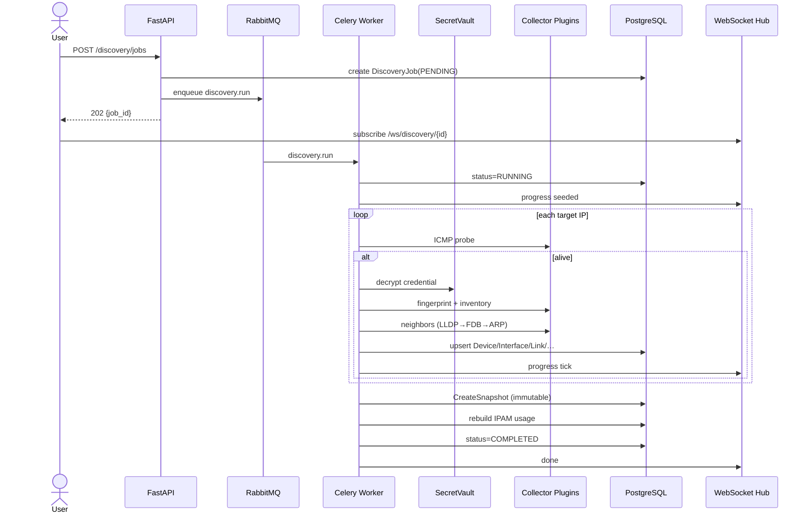
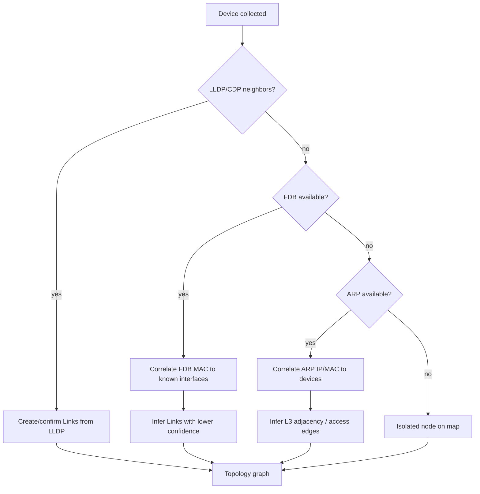
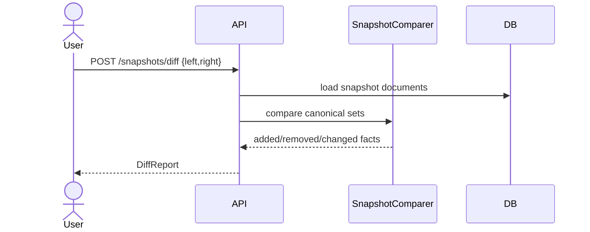
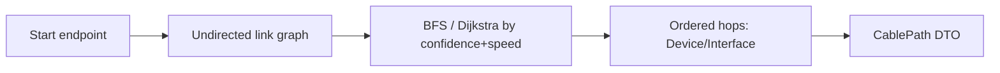
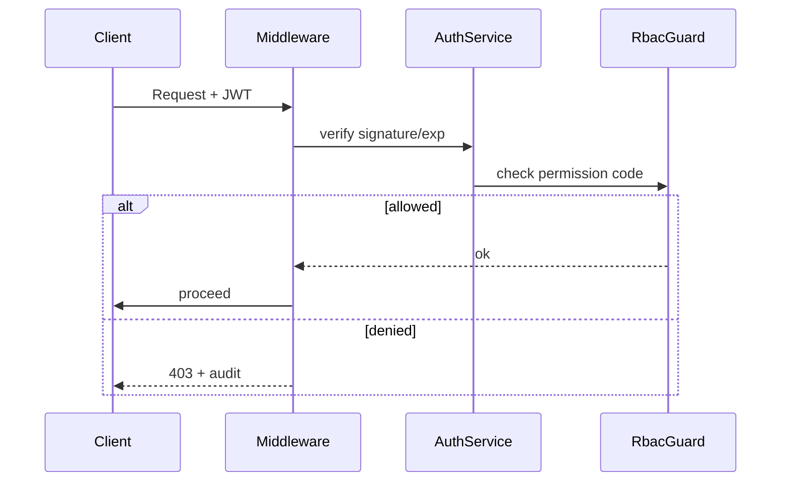

# Interaction Diagrams

## Discovery Job Flow

```mermaid
sequenceDiagram
    actor User
    participant API as FastAPI
    participant Bus as RabbitMQ
    participant Worker as Celery Worker
    participant Vault as SecretVault
    participant Coll as Collector Plugins
    participant DB as PostgreSQL
    participant WS as WebSocket Hub

    User->>API: POST /discovery/jobs
    API->>DB: create DiscoveryJob(PENDING)
    API->>Bus: enqueue discovery.run
    API-->>User: 202 {job_id}
    User->>WS: subscribe /ws/discovery/{id}

    Bus->>Worker: discovery.run
    Worker->>DB: status=RUNNING
    Worker->>WS: progress seeded
    loop each target IP
        Worker->>Coll: ICMP probe
        alt alive
            Worker->>Vault: decrypt credential
            Worker->>Coll: fingerprint + inventory
            Worker->>Coll: neighbors (LLDP→FDB→ARP)
            Worker->>DB: upsert Device/Interface/Link/…
            Worker->>WS: progress tick
        end
    end
    Worker->>DB: CreateSnapshot (immutable)
    Worker->>DB: rebuild IPAM usage
    Worker->>DB: status=COMPLETED
    Worker->>WS: done
```

## Neighbor Resolution Strategy

```mermaid
flowchart TD
    A[Device collected] --> B{LLDP/CDP neighbors?}
    B -->|yes| C[Create/confirm Links from LLDP]
    B -->|no| D{FDB available?}
    D -->|yes| E[Correlate FDB MAC to known interfaces]
    E --> F[Infer Links with lower confidence]
    D -->|no| G{ARP available?}
    G -->|yes| H[Correlate ARP IP/MAC to devices]
    H --> I[Infer L3 adjacency / access edges]
    G -->|no| J[Isolated node on map]
    C --> K[Topology graph]
    F --> K
    I --> K
    J --> K
```

## Snapshot Diff

```mermaid
sequenceDiagram
    actor User
    participant API
    participant Diff as SnapshotComparer
    participant DB

    User->>API: POST /snapshots/diff {left,right}
    API->>DB: load snapshot documents
    API->>Diff: compare canonical sets
    Diff-->>API: added/removed/changed facts
    API-->>User: DiffReport
```

## Cable Path Resolution

```mermaid
flowchart LR
    S[Start endpoint] --> G[Undirected link graph]
    G --> BFS[BFS / Dijkstra by confidence+speed]
    BFS --> P[Ordered hops: Device/Interface]
    P --> R[CablePath DTO]
```

## AuthN / AuthZ

```mermaid
sequenceDiagram
    participant C as Client
    participant MW as Middleware
    participant Auth as AuthService
    participant RBAC as RbacGuard

    C->>MW: Request + JWT
    MW->>Auth: verify signature/exp
    Auth->>RBAC: check permission code
    alt allowed
        RBAC-->>MW: ok
        MW->>C: proceed
    else denied
        MW-->>C: 403 + audit
    end
```
